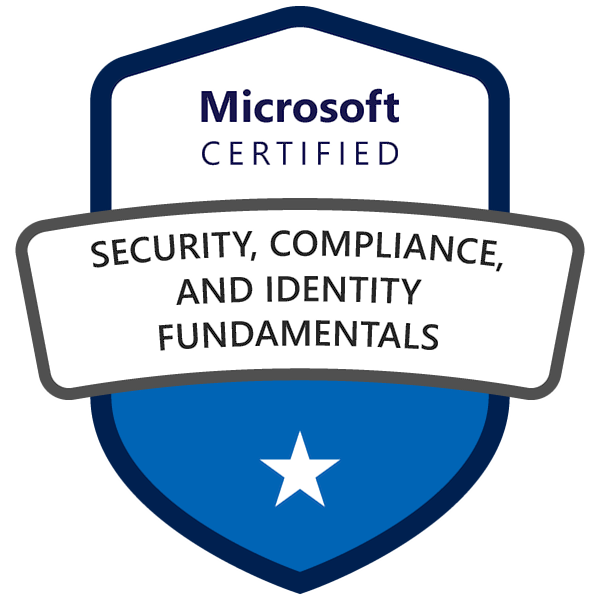

# Hey there, I am Varun ! 

 

 

## About Me
DevOps and Cloud Security professional with strong analytical skills and competence in automation and multi cloud infrastructure, with a focus on leveraging the cloud's capabilities while ensuring high availability and scalability. Capable of defining multi-cloud security architectural direction, vision, and guiding principles to align with the organization's strategy and long term vision. Dynamic, results-oriented individual with a strong track record of performance providing technical, strategic and operational leadership in uniquely challenging situations. Offering 9+ years of experience in uniquely complex environments.

The ability of employees to understand customer issues, assess the best approach to solving them, and then work until the effective and efficient solutions are identified is a crucial advantage in today's global cloud industry. I've honed the ability to think and act from this perspective throughout the years.

---

## Domain
AWS | GCP | Azure | DevOps | Security | DevSecOps | Automation

---

## Tech Stack
### Operating Systems
* OSX
* Ubuntu
* CentOS
* RedHat
* Windows

### Languages
* Shell Scripting
* HTML
* Python (working knowledge)

### Configuration Management
* Ansible

### Continuous Integration Tools
* Jenkins
* CodeBuild
* Github Actions
* GitLab

### Continuous Delivery Tools
* Github
* AWS CodeDeploy

### Cloud Platforms
* AWS
* GCP
* Azure

### Infrastructure as Code:
* Terraform
* AWS CloudFormation

### Security
* CloudCustodian (AWS)
* Security Monkey (AWS)
* Cloudsploit (AWS)
* CloudTracker (AWS)
* PacBot (AWS)
* Security Command Center (GCP)
* AWS Cognito (AWS)
* AWS SSO (AWS)
* AWS Security Hub
* SAML2.0 (AWS/Google Workspace/GCP
* DNS Best Practices

### Containerisation
* ECS
* Docker
* Kubernetes (working knowledge)

### Monitoring Tools
* AWS CloudWatch
* Elastic Stack
* Stackdriver
* NewRelic
* Nagios
* RunScope
* Grafana

### Database
* MySQL
* MariaDB
* AuroraDB
* PostgreSQL
* MSSQL

### Administration
* Google Workspace
* Slack
* Atlassian Suite
* Lucidchart Enterprise
* Github

## Cloud Stack
### Security
* AWS Certificate Manager
* AWS CloudHSM
* AWS Identity and Access Management
* AWS Key Management Service
* AWS Secrets Manager
* AWS Security Hub
* AWS Shield
* AWS Single Sign On
* AWS WAF
* Amazon Cognito
* Amazon GuardDuty
* Amazon Inspector
* Amazon Macie

### IaC
* AWS CloudFormation

### Audit and Compliance
* AWS CloudTrail
* AWS Config

### Account Management and Governance
* AWS Organizations
* AWS Control Tower

### Monitoring
* AWS Personal Health Dashboard
* AWS Systems Manager
* AWS Trusted Advisor
* Amazon CloudWatch

### Networking and CDN
* AWS Direct Connect
* AWS Site to Site VPN
* AWS Transit Gateway
* Amazon API Gateway
* Amazon CloudFront
* Amazon Route 53
* Amazon VPC
* Elastic Load Balancing

### Serverless Computing
* AWS Fargate
* AWS Lambda
* Amazon Application Auto Scaling
* Amazon EC2 Container Registry
* Amazon EC2
* Amazon Elastic Container Service
* Amazon Elastic Kubernetes Service
* Amazon Lightsail

### Billing and Budgets
* AWS Budgets
* AWS Cost Explorer
* AWS Cost Management
* AWS Cost and Usage Report
* Reserved Instance Reporting
* Savings Plans

### Storage
* AWS Backup
* Amazon Elastic Block Storage (EBS)
* Amazon Elastic File System (EFS)
* Amazon S3 Glacier
* Amazon Simple Storage Service (S3)

### Deployments and Builds
* AWS CodeBuild
* AWS CodeCommit
* AWS CodeDeploy
* AWS CodePipeline

### Databases
* AWS Database Migration Service
* Amazon Aurora
* Amazon DynamoDB
* Amazon ElastiCache
* Amazon RDS
* Amazon ElastiCache

### Communication
* AWS Support
* Amazon Simple Email Service (SES)
* Amazon Simple Notification Service (SNS)

### Query Engines
* Amazon Athena
* Amazon Elasticsearch Service

## GCP
### Networking and CDN
* Cloud Armor
* Cloud CDN
* Cloud DNS
* Cloud Firewall Rules
* Cloud Load Balancing
* Cloud Network
* Cloud Router
* Cloud Routes
* Cloud VPN
* Premium Network Tier
* Standard Network Tier
* Virtual Private Cloud

### Logging and Monitoring
* Cloud APIs
* Cloud Billing APIs
* Cloud Console
* Cloud Shell
* Stackdriver
* Logging
* Monitoring

### Compute
* App Engine
* Compute Engine
* Container Optimized OS
* Cloud Functions

### IAM and Security
* Cloud IAM
* Cloud Security Command Center
* Cloud Security Scanner

### Storage
* Cloud Storage
* Persistent Disk

### Database
* Cloud SQL

---
## Certifications

 

 
 

 

## Education
| Qualification | Institution | Year |
|   --  |   --  |   --  |
| B. Tech (Information Technology) | PIET, Jaipur, Rajasthan | 2007 - 2011 |

[comment]: <> "| Higher Secondary Certificate &#40;Science&#41; | Hindustani Kendriya Vidyalaya, Guwahati, Assam | 2006 – 2007 |"

[comment]: <> "| Secondary School Certificate | BRCM Public School, Bahl, Haryana | 2003 – 2004 |"

## Experience
### [CloudCover Consultancy Pvt. Ltd.](https://cldcvr.com)
#### Lead - DevSecOps
* Full Time 
* July 2021 - Present

**Responsibilities**:

* Experience in creating a team from scratch, defining its charter, providing guidance and growing careers of the team members.
* Explore and implement new technologies for cloud platforms, software configuration and deployment, and security.
* Find innovative ways to speed up or synchronize processes, making them more seamless. Design and build extremely reliable, scalable and high performing enterprise systems.
* Discovering restrictions in the infrastructure and software environment that reduce the effectiveness of the process.
* Experience in the development of a roadmap for the evolution of the architecture for customers, planning, and integration of legacy environments into a transformed environment.
* Understand the requirements for CI/CD to design a comprehensive solution for clients, Product Managers, IT team, Operations team and other business requirement owners.

#### Senior DevOps Engineer
* Full Time 
* April 2018 – July 2021

**Responsibilities**:

* Working on different cloud environments, such as AWS and GCP.
* Automations focussed heavily on cloud using **Cloud CLI/SDK/API**
* Collaborate with different teams and other contributors to **ensure compliance and risk management**.
* Implementing **security best practices** on AWS and GCP, adhering to the shared responsibility model of public clouds.
* Performing **Auditing** and **Security Assessments**, not limited to AWS or GCP.
* **Design and architect solutions** for clients to solve business problems in a cloud environment.
* Performing various **proofs -of- concepts scenarios** for distinct client requirements.
* Architecting solutions on cloud and implementing **secure, automated, scalable** and **highly available** infrastructure as a hybrid cloud implementation while working with the team to ensure delivery.
* Performing high level **cost optimization** activities on cloud to reduce expenditure by substantial difference.
* Creating parameterized infrastructure as code for clients for easier deployment and scaling of infrastructure resulting in the redeployment of any environment with rapid turnaround time using **Terraform** or **CloudFormation**
* **Migrating from on-premises/private cloud** to AWS/GCP cloud, coordinating with various teams to ensure minimal to zero downtime.
* Implementing and managing monitoring, logging and alerting solutions using **AWS CloudWatch**, **Stackdriver**, and **Elastic Stack** enabling us to quickly resolve any issue and create RCA for the same.
* Implementing self healing environments by leveraging native cloud services such as **CloudWatch Alarms**, **autoscaling groups** and custom scripts.
* Creation of project **documentation**, presentations, blogs.
* Interactive Messaging and ChatOps using **Slack**.

#### DevOps Engineer
* Full Time 
* April 2017 – March 2018

**Responsibilities**:

* Coordinating with different teams on multiple clouds and automation projects.
* Application Monitoring using tools such as Nagios, NewRelic, RunScope.
* Managing AWS and GCP resources such as RDS, EC2.
* Automated deployments using CI/CD tools such as Jenkins.
* Source code management using Github
* Deploy, monitor and secure cloud infrastructure multiple environments.
* Assisting customers on migrating their application from premises to cloud with unique solutions.
* Responsible for designing and implementing noteworthy solutions as per client's requirements.
* Strong analytical and problem-solving skills.

#### SysOps Engineer
* Full Time 
* Feb 2016 – March 2017

**Responsibilities**:

* Monitoring, Managing and Troubleshooting the Network Infrastructure.
* Servers migration from on-premises to Amazon Web Services (AWS).
* Hands on experience on different monitoring tools such as PRTG, Nagios.
* Interact effectively with members of the various technical teams within the organization.
* Handling multiple instances, volumes and snapshots within a single AWS Console.
* Working with AWS CLI and shell scripts to automate repetitive tasks, thereby reducing manual effort.

#### Project Details

##### Video Rendering on AWS

* This was for the leading video rendering and visual effects studio
* Used multiple **c4.8xlarge** instances for rendering purposes.
* Using shared storage for rendering output.
* **Tools:** Thinkbox Deadline, Aspera, Maya
* **Technologies:** Shell Scripting, AWS

##### Streaming Service on AWS

* This is for Asia’s leading video streaming service.
* Multiple monolithic services containerized on AWS.
* Terraform was used to setup new service.
* Jenkins is used to create docker images and deploy on registry.
* Automated deployments using Slack and Jenkins integration.
* Periodic optimizations and resizing activity with minimal downtime.
* Periodic security audits to fix and mitigate any security loopholes.
* Periodic OS patching to fix and mitigate any vulnerabilities.
* **Tools:** Jenkins, Slack.
* **Technologies**: Shell Scripting, Python, AWS, NodeJS.

##### Migration from DC to Google Compute Platform

* This is for an Indian diversified financial services company headquartered in Mumbai.
* The goal was to migrate core infrastructure and multiple websites from on-premise DC to Google Cloud.
* The migration included successfully setting up Windows Server Failover Clustering.
* Periodic optimizations and resizing activity with minimal downtime.
* Periodic security audits to fix and mitigate any security loopholes.
* Periodic OS patching to fix and mitigate any vulnerabilities.
* **Tools:** Ansible.
* **Technologies**: Shell Scripting

##### Mixed environments on AWS

* This is for a company that is known for having a significant prominence in Indian retail and fashion sectors, with popular supermarket chains.
* Different environments as per teams and applications.
* **Tools:** Ansible, CloudFormation, Terraform.
* **Technologies**: Shell Scripting

##### Implementing zero-trust applications in CloudCover

* Leveraging Cloud Identity and Google Workspace, various applications that follow zero-trust principle and SAML 2.0 protocols have been set up so that access control is tied to the individual. Some examples:
  * AWS SSO with Google Workspace
  * CldCvr HR Portal
  * Traildash (Centralized Elastic Stack for CloudTrail logs)
  * DevOps Jenkins Automation Box

##### Active participation in ISO 27001 Audit

* Handled **Access Control** component of ISO audit in which we had to showcase different types of access control mechanisms ranging from different applications, softwares and cloud.
* Handled **Organization of Information Security** aspect of ISO audit.

##### Working in tandem with sister companies for regular security audits

* Regular VA/PT of production servers in AWS
* Regular assessment of production accounts for any vulnerability on AWS

---

### [Mithi Software Technologies Pvt. Ltd.](https://www.mithi.com/)

#### Linux Support Engineer

* Full Time
* May 2013 – Jan 2016

**Responsibilities**:

* Monitoring, Managing and Troubleshooting the Network Infrastructure.
* Remote Installation, Deployment, Reconfiguration of product ConnectXF (MCS) on Linux
  platform, configuring, monitoring and testing of Email Servers for spectrum of clients.
* Configuring servers for Mithi Hosted Email services and Addressing the performance
  bottleneck and ensuring maximum Network and Server uptime.
* Delivering Monthly Technical Face-to-Face Training Sessions for clients In-Premise.
* Preparing the remote client-site in typical Distributed Multi-Server Email system.

**Additional Responsibilities:**

* Actively Assisting as a part of Mithi Support in providing 24×7 remote Support to clients
  and handling emergencies.

#### Systems Engineer, Kaizen Team, R and D Department

* Full Time
* May 2013 – Jan 2016

**Responsibilities**:

* Employing new technologies to solve difficult problems and issues using given set of skills.
* Building and delivering stable, serviceable solutions in an independent fashion in regards with the company's requirements.
* Interact effectively with members of the various technical teams within the organization.
* Hands on experience on different monitoring tools such as PRTG, Nagios.
* Servers migration from hardware to cloud on Amazon Web Services (AWS).
* Handling multiple instances, volumes and snapshots within a single AWS Console.
* Managing capacity of storage and NAS, such as FreeNAS, NexentaStor and related activities such as Disk Mirroring, scheduling jobs, etc.

**Deployed Projects (clients)**:

* SBI Life
* Vibatel Solutions
* Mahindra Swaraj
* Karnataka Bank
* Linkwell
* O Source
* Motif INC.
* South Indian Bank.

## Hobbies
&nbsp;&nbsp;&nbsp;&nbsp;&nbsp;&nbsp;&nbsp;&nbsp;

## Soft Skills
&nbsp;&nbsp;&nbsp;&nbsp;&nbsp;&nbsp;&nbsp;&nbsp;

---

## 📕 Blog posts
<!-- BLOG-POST-LIST:START -->
- [WSL2 with Windows Terminal and syncing with Mac OSX](https://vrnchndk.in/2020/08/29/WSL2-with-Windows-Terminal-and-syncing-with-Mac-OSX/)
- [RDS Authentication via IAM User/Role](https://vrnchndk.in/2019/05/01/RDS-Authentication-via-IAM-User-Role/)
- [Auto update ASG with latest image and launch config](https://vrnchndk.in/2019/04/06/Auto-update-ASG-with-latest-image-and-launch-config/)
- [NFS Failover with DRBD and Heartbeat on AWS EC2](https://vrnchndk.in/2018/11/28/NFS-Failover-with-DRBD-and-Heartbeat-on-AWS-EC2/)
- [AMI Backups and Retention using AWS Lambda](https://vrnchndk.in/2018/08/04/AMI-Backups-and-Retention-using-AWS-Lambda/)
<!-- BLOG-POST-LIST:END -->

